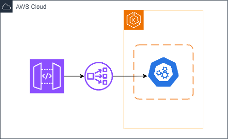

# DOCUMENTAÇÃO TÉCNICA - VALIDAÇÃO DE JWT

## INTRODUÇÃO

Este documento descreve a arquitetura e funcionamento de uma aplicação desenvolvida para realizar a validação de tokens JWT (JSON Web Tokens). A aplicação tem como objetivo verificar a autenticidade e validade dos tokens recebidos, garantindo que as informações presentes nas claims estão em conformidade com as regras de segurança. Além disso, o sistema está preparado para rodar em ambientes de produção utilizando containers e orquestração com Kubernetes (EKS).

## TECNOLOGIAS UTILIZADAS

- **Linguagem:** Java 21
- **Frameworks:**
  - **Spring Boot**: Para gerenciamento de dependências, configuração automática e construção da API REST.
  - **JUnit 5**: Para testes unitários e validação de funcionalidades.
- **Containerização:** Docker para empacotamento da aplicação.
- **Orquestração:** Kubernetes com EKS (Elastic Kubernetes Service) para gerenciar o cluster onde a aplicação é implantada.
- **API Gateway**: Para rotear as requisições e proteger os endpoints.
- **NLB (Network Load Balancer):** Para balanceamento de carga entre as instâncias no cluster EKS.

## ARQUITETURA

A arquitetura da aplicação segue um padrão baseado em microserviços e conta com os seguintes componentes principais:



1. **API Gateway**: Recebe as requisições externas e faz o roteamento para o serviço de validação de JWT.
2. **NLB (Network Load Balancer)**: Distribui as requisições entre os nós do cluster EKS, garantindo alta disponibilidade.
3. **EKS (Elastic Kubernetes Service)**: Cluster Kubernetes que gerencia a aplicação e seus recursos, oferecendo escalabilidade e resiliência.

## ENTENDENDO A APLICAÇÃO

Este serviço Java (`JwtServiceImpl`) é responsável por validar tokens JWT (JSON Web Token). Ele decodifica o token, analisa suas claims e realiza validações específicas para garantir que o token esteja em conformidade com os requisitos definidos.

## SETUP

Para configurar e rodar a aplicação localmente, siga os passos abaixo:

1. **Clonar o repositório:**

   ```bash
   git clone https://github.com/seu-usuario/backend-challenge.git

2. **Navegar até o diretório da aplicação:**

   ```bash
   cd backend-challenge/app/jwtvalidator

3. **Compilar e empacotar a aplicação:**

   ```bash
   mvn clean install

4. **Rodar a aplicação localmente:**

   ```bash
   mvn spring-boot:run

## PRÓXIMOS PASSOS

### Adicionar Observabilidade

- Integrar com o **Prometheus** para monitoramento de métricas, como tempo de resposta e taxa de erros.
- Configurar logs estruturados usando um sistema de log centralizado como o **ELK** (Elasticsearch, Logstash, Kibana).

### Configuração de Health Checks

- Adicionar endpoints de **liveness** e **readiness** para verificar se o serviço está ativo e pronto para receber requisições.

### Ajustar CIDR da VPC para o Tráfego

- Revisar e ajustar as configurações de **CIDR da VPC** para garantir que o tráfego entre o NLB e o cluster EKS seja permitido de acordo com as regras de firewall.

### Parametrização de Informações Sensíveis

- Parametrizar variáveis de ambiente e configurações sensíveis (como chaves e credenciais) usando o **AWS Secrets Manager** ou o **Kubernetes Secrets**.

### Melhoria da segurança

- Implementar validações da assinatura JWT.

### Implementação de validação utilizando JSON Schema

- Integrar validação de payload usando JSON Schema, garantindo uma validação robusta e flexível da estrutura e das claims presentes no token.

